# Arsitektur Bubblepi Store

## Stack & Versi

| Layer | Teknologi | Versi |
|---|---|---|
| Framework | Next.js App Router | 16.2.10 |
| Language | TypeScript strict | ^5 |
| UI | shadcn/ui + Tailwind CSS | v4 (CSS-based config) |
| Animation | Framer Motion | ^12 |
| Backend | Go API (`lib/api-client.ts` → Go backend) | — |
| Database | PostgreSQL (Neon) | — |
| Payment | Xendit Invoice API | xendit-node ^7 |
| Email | Resend + React Email | — |
| Auth | jose (JWT httpOnly cookie) | ^6.2.3 |
| Validation | Zod | ^4.4.3 |
| Package manager | pnpm | v9+ |
| Deployment | Vercel (Next.js) + Railway (Go backend) | — |

## Arsitektur Dua-Backend

Sistem menggunakan arsitektur dual-backend:

- **Next.js (Frontend)** — Server rendering, halaman storefront, admin panel, middleware JWT, UTM tracking
- **Go Backend (API Server)** — Seluruh CRUD, payment, email, supplier integration. Next.js mengakses via `lib/api-client.ts` (internal request pakai `X-Internal-Token`, browser request via `NEXT_PUBLIC_GO_API_URL`)

## Diagram Alur

---

### 1. Checkout Flow

Customer memilih produk, input data, memilih metode bayar, lalu submit pesanan. Sistem membuat order, lalu redirect ke Xendit.

```mermaid
sequenceDiagram
    actor Customer
    participant Storefront as Next.js Storefront
    participant GoAPI as Go Backend
    participant DB as PostgreSQL
    participant Xendit
    participant Resend

    Customer->>Storefront: browsing → add variant ke cart
    Customer->>Storefront: pergi ke /checkout
    Storefront->>Storefront: Step 1: input nama & email & payment method
    Storefront->>Storefront: Step 2: konfirmasi + voucher validation
    Storefront->>+GoAPI: POST /api/orders { guestName, guestEmail, items, voucherId }
    GoAPI->>DB: create Order (PENDING) + OrderItems
    GoAPI-->>-Storefront: { orderId, orderNumber, total }
    Storefront->>+GoAPI: POST /api/payments/create { orderId, paymentMethod }
    GoAPI->>+Xendit: createInvoice()
    Xendit-->>-GoAPI: { invoiceUrl, invoiceId }
    GoAPI->>DB: update Order (AWAITING_PAYMENT)
    GoAPI-->>-Storefront: { paymentUrl }
    Storefront->>Storefront: Step 3: show payment page + 24h countdown + auto-poll
    Customer->>Xendit: bayar via QRIS / Virtual Account
    Xendit->>+GoAPI: POST /webhooks/xendit { status: PAID }
    GoAPI->>DB: update Order (PAID)
    GoAPI->>GoAPI: fulfillOrder() → assign AccountStock
    GoAPI->>DB: AccountStock AVAILABLE → ASSIGNED → DELIVERED
    GoAPI->>Resend: send credential email (decrypted AES-256)
    GoAPI-->>-Xendit: 200 OK
    Storefront->>+GoAPI: poll GET /api/orders/{id}
    GoAPI-->>-Storefront: status DELIVERED
    Customer->>Storefront: redirect ke /orders/{id}
```

**Detail:**
- File: `app/(store)/checkout/page.tsx` — orchestrator 3-step checkout
- `components/store/CheckoutStep1.tsx` — form data pembeli + pilih payment method + abandoned cart save
- `components/store/CheckoutStep2.tsx` — konfirmasi pesanan + voucher + upsell
- `components/store/CheckoutStep3.tsx` — payment page dengan countdown 24h + auto-poll tiap 5 detik
- `components/store/StepIndicator.tsx` — visual step indicator
- Rate limit: 10 req/jam/IP untuk create order dan create payment

---

### 2. Payment Webhook & Fulfillment Flow

Xendit mengirim callback ke webhook. Sistem memverifikasi token, update status, lalu fulfill.

```mermaid
sequenceDiagram
    participant Xendit
    participant GoAPI as Go Backend
    participant DB as PostgreSQL
    participant Resend
    participant Telegram

    Xendit->>+GoAPI: POST /webhooks/xendit { status: PAID, external_id }
    Note over GoAPI: verify x-callback-token header
    GoAPI->>DB: read Order by orderNumber
    GoAPI->>DB: update Order (PAID), set paidAt
    GoAPI->>GoAPI: fulfillOrder(orderId)
    
    loop for each OrderItem
        GoAPI->>DB: $transaction: find AVAILABLE AccountStock
        GoAPI->>DB: update AccountStock → ASSIGNED → set orderId
        alt stock tersedia
            GoAPI->>GoAPI: decrypt credentials (AES-256-GCM)
            GoAPI->>DB: update AccountStock → DELIVERED
        else stok habis
            GoAPI->>DB: set OrderItem status PENDING_STOCK
            GoAPI->>Telegram: kirim notifikasi stok habis
        end
    end

    alt all items fulfilled
        GoAPI->>DB: update Order → FULFILLED / DELIVERED
        GoAPI->>Resend: sendOrderConfirmation() + sendAccountDelivery() email
    else ada PENDING_STOCK
        GoAPI->>DB: update Order → PROCESSING
    end

    GoAPI-->>-Xendit: 200 OK { success: true }

    alt webhook untuk EXPIRED / FAILED
        Xendit->>GoAPI: POST /webhooks/xendit { status: EXPIRED }
        GoAPI->>DB: update Order (FAILED)
        GoAPI->>Resend: sendOrderExpired() email
        GoAPI-->>Xendit: 200 OK
    end
```

**Detail:**
- File: Go backend webhook handler
- Idempotent: jika order sudah PAID/FULFILLED, webhook skip dengan `{ success: true, skipped: true }`
- Rate limit webhook: 100 req/menit/IP
- Enkripsi: AES-256-GCM, format `iv:authTag:ciphertext`, decrypt hanya saat fulfill
- Transaction stock assignment mencegah overselling

---

### 3. Admin Auth Flow

Admin login via password, Go backend set JWT cookie.

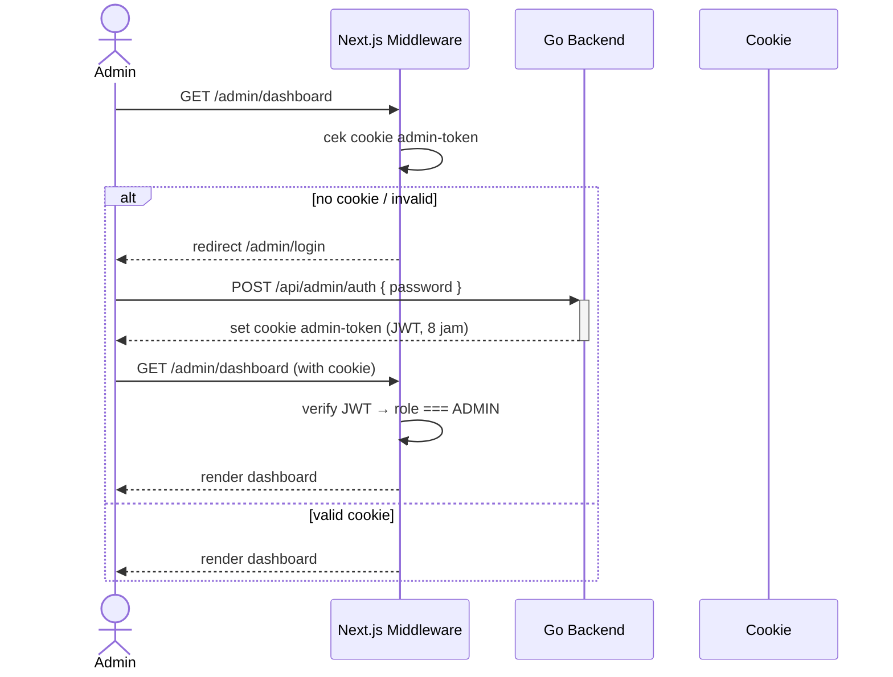

**Detail:**
- File: `middleware.ts` — admin route protection, UTM/referral cookie tracking
- `lib/auth.ts` — `getUserFromSession()` verify JWT dari cookie
- Rate limit login: 5 percobaan/15 menit/IP

---

### 4. Warranty Claim Flow

Customer klaim garansi untuk item yang bermasalah. Admin review dan approve/reject.

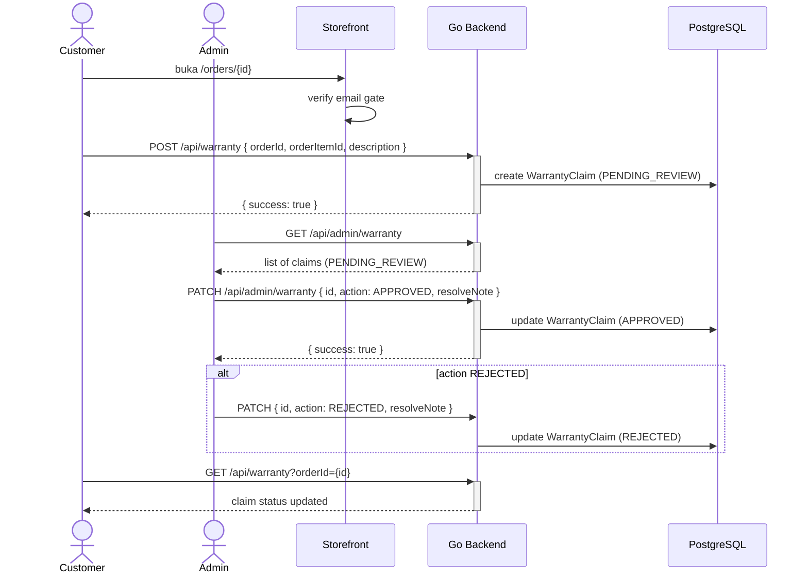

**Detail:**
- File: `app/admin/warranty/page.tsx` + `WarrantyList.tsx` — admin list + approve/reject
- `components/store/WarrantyTimer.tsx` — visual progress bar garansi di halaman order
- `app/(store)/orders/[id]/page.tsx` — customer claim form

---

### 5. Review Flow

Customer yang sudah order bisa menulis review. Admin bisa approve/pin/reject.

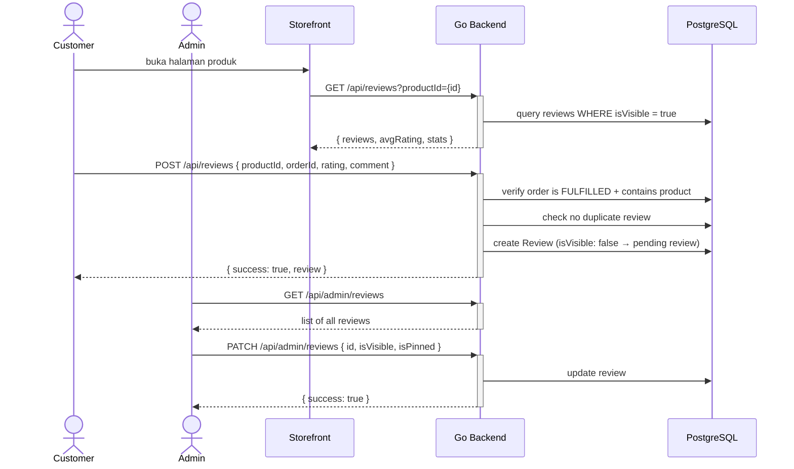

**Detail:**
- File: `components/store/ReviewSection.tsx` — display + form
- `app/admin/reviews/page.tsx` + `ReviewList.tsx` — admin management
- Validasi: order FULFILLED, satu review per order per produk

---

### 6. Voucher Validation Flow

Customer masukkan kode voucher di checkout step 2.

```mermaid
sequenceDiagram
    participant Customer
    participant Storefront
    participant GoAPI as Go Backend
    participant DB as PostgreSQL

    Customer->>Storefront: input kode voucher
    Storefront->>+GoAPI: POST /api/vouchers/validate { code, cartTotal }
    GoAPI->>DB: find Voucher by code
    alt voucher tidak ditemukan
        GoAPI-->>-Storefront: { valid: false, error: "Kode tidak valid" }
    else voucher expired / habis / inactive
        GoAPI-->>-Storefront: { valid: false, error: "..." }
    else cartTotal < minOrder
        GoAPI-->>-Storefront: { valid: false, error: "Minimum order..." }
    else valid
        GoAPI-->>-Storefront: { valid: true, discount, voucherId, type, value }
        Storefront->>Storefront: apply discount ke UI
    end
```

**Detail:**
- Rate limit: 20 req/jam/IP
- Types: PERCENT (persen) atau FIXED (nominal)

---

### 7. Price Drop Notification Flow

Customer daftar notifikasi harga turun untuk suatu variant.

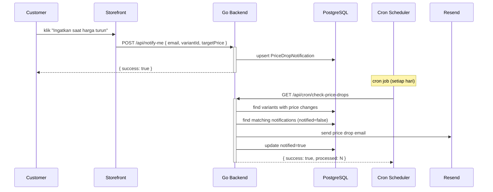

**Detail:**
- File: `components/store/PriceDropNotify.tsx` — form + localStorage state
- Upsert: jika email+variantId sudah ada, update targetPrice + reset notified

---

### 8. Order Lookup & Credential Reveal Flow

Customer cek pesanan via email, verify email, lalu lihat credentials.

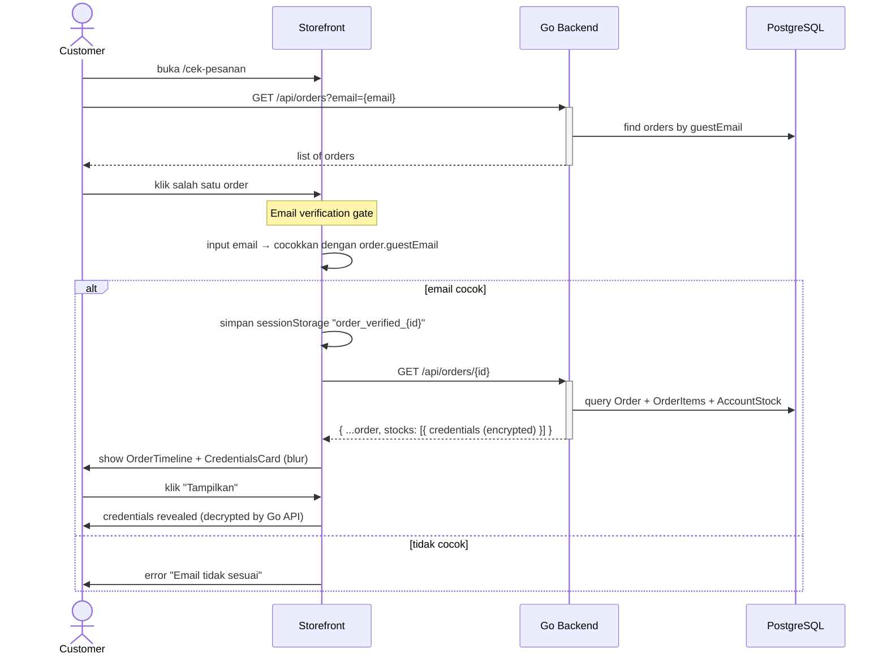

**Detail:**
- File: `app/(store)/cek-pesanan/page.tsx` — search by email
- `app/(store)/orders/[id]/page.tsx` — detail + verification gate + credentials + warranty + referral
- `components/store/CredentialsCard.tsx` — blur reveal + copy
- `components/order/credential-display.tsx` — alternate credential display
- Credentials didecrypt oleh Go backend sebelum dikirim ke frontend

---

### 9. Referral Flow

Customer bagikan link referral. Saat referral order selesai, komisi dicatat.

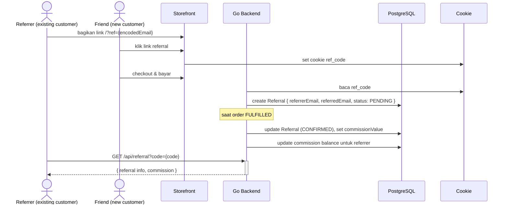

**Detail:**
- File: `app/admin/referrals/page.tsx` — admin view + stats
- `app/(store)/orders/[id]/page.tsx` — referral link sharing di halaman order
- middleware.ts — cookie `ref_code` diset dari query param `ref`

---

### 10. Analytics Funnel Flow

Frontend mengirim event funnel untuk tracking konversi.

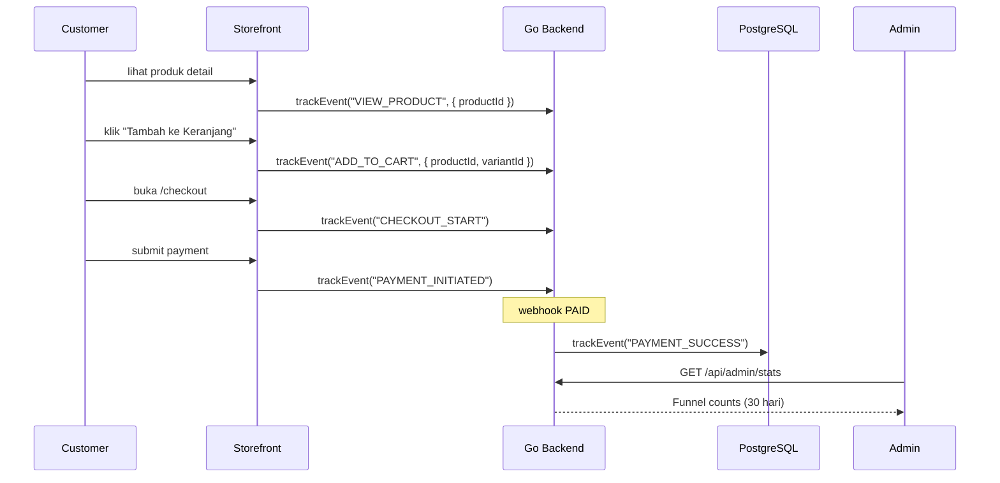

**Detail:**
- File: `lib/analytics.ts` — client-side tracking via `trackEvent()`
- `components/store/ProductViewTracker.tsx` — auto-track VIEW_PRODUCT
- Events: VIEW_PRODUCT → ADD_TO_CART → CHECKOUT_START → PAYMENT_INITIATED → PAYMENT_SUCCESS
- Rate limit: 100 req/menit/IP
- `components/admin/analytics-funnel.tsx` — admin funnel visualization

---

### 11. Admin CRUD Flows

Admin mengelola produk, stok, voucher, supplier, pricelist via Go API.

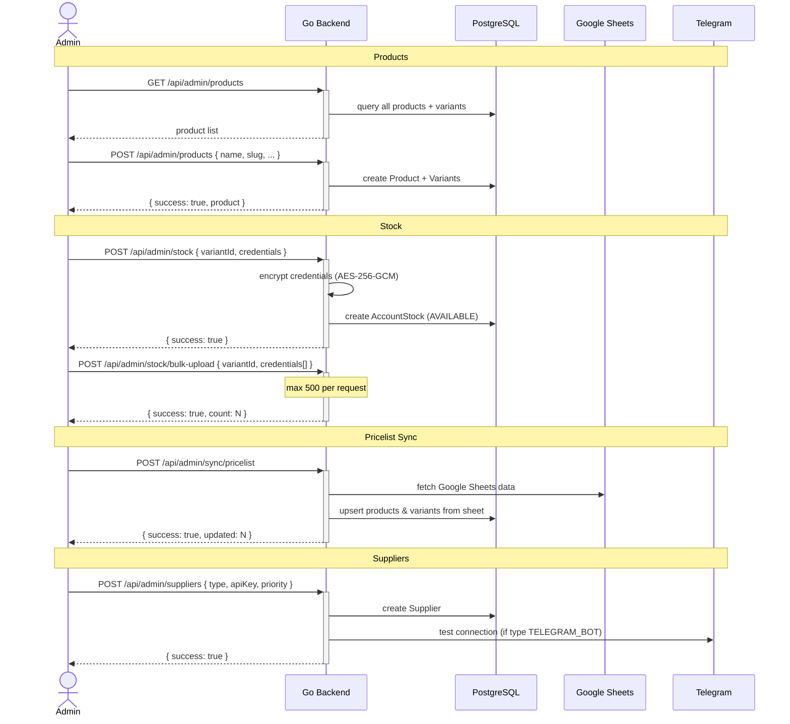

**Detail:**
- File: `app/admin/products/*`, `app/admin/stock/*`, `app/admin/suppliers/*`, `app/admin/pricelist/*`
- `components/admin/BulkFulfillButton.tsx` — bulk fulfill PAID orders
- `components/admin/CsvUploadButton.tsx` — CSV stock upload
- Supplier types: TELEGRAM_BOT (`lib/suppliers/telegram-bot.ts`) dan API HTTP (`lib/suppliers/api-http.ts`)

---

### 12. Cron Jobs Flows

Scheduler memanggil cron endpoint secara periodik.

**Order Expiry (setiap 5 menit):**
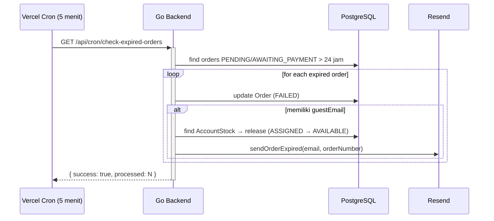

**Email Retry (setiap 15 menit):**
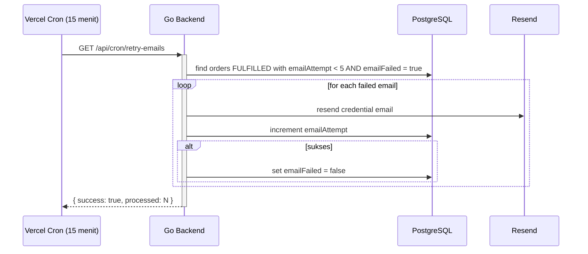

**Auto-Retry Fulfillment (setiap 15 menit):**
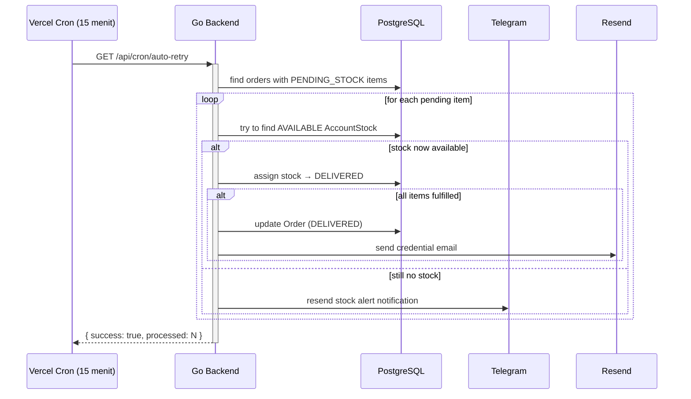

**Low Stock Alert (setiap 6 jam):**
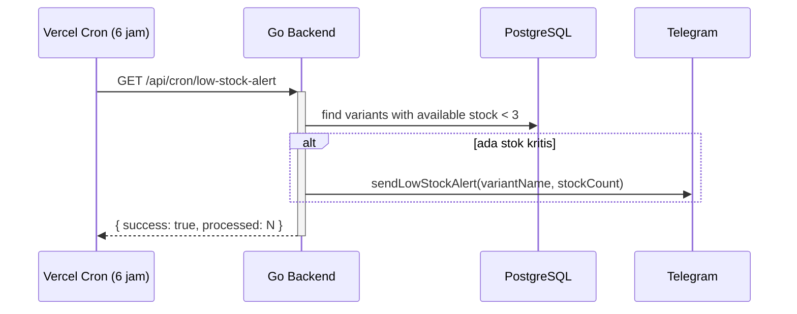

**Abandoned Cart (setiap 30 menit):**
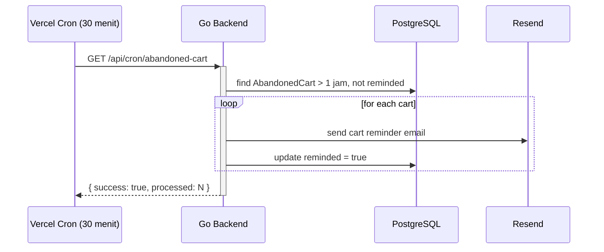

**Renewal Reminder (setiap hari pukul 09:00):**
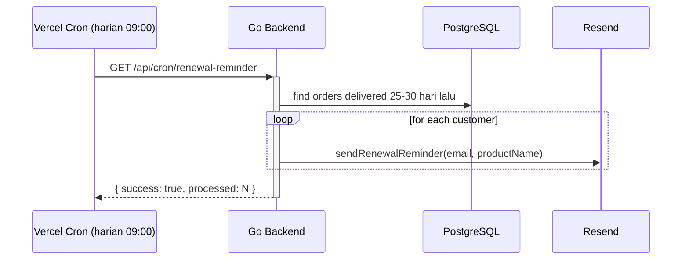

**Daily Report (setiap hari pukul 07:00):**
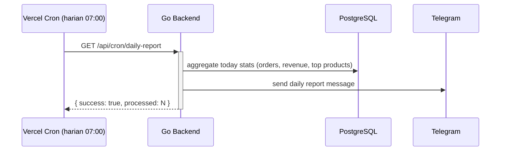

**Weekly Summary (setiap Senin 08:00):**
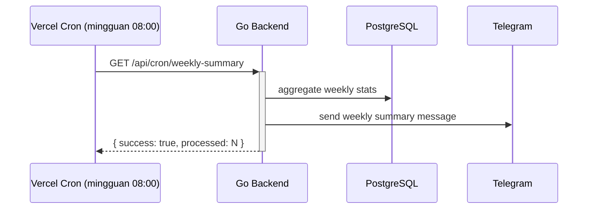

**Auto Cleanup (setiap hari pukul 02:00):**
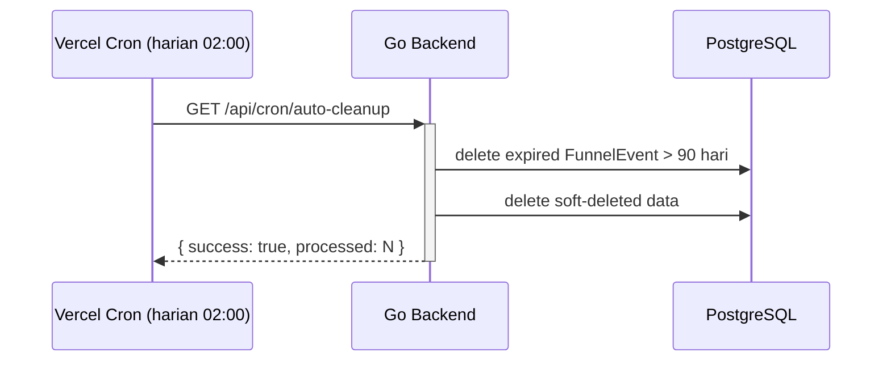

---

### 13. Live Activity & Social Proof Flow

Storefront menampilkan aktivitas real-time untuk social proof.

```mermaid
sequenceDiagram
    participant Storefront
    participant GoAPI as Go Backend
    participant DB as PostgreSQL

    Storefront->>+GoAPI: GET /api/live-activity
    GoAPI->>DB: query recent fulfilled orders (last 1 jam)
    GoAPI-->>-Storefront: [{ firstName, city, productName }]

    Storefront->>+GoAPI: GET /api/stats/social-proof
    GoAPI->>DB: aggregate totalOrders, totalBuyers, avgFulfillTime
    GoAPI-->>-Storefront: { totalBuyers, todaySales, lastFulfillMins }
```

**Detail:**
- File: `components/store/SocialProofBanner.tsx` — animated counter
- `components/store/LiveFulfillmentBadge.tsx` — "Terakhir fulfill: X — Y menit lalu"
- `components/store/LiveActivityToast.tsx` — toast notifikasi

---

### 14. Product Browsing Flow

Customer browsing produk, lihat detail, cek stok, upsell.

```mermaid
sequenceDiagram
    actor Customer
    participant Storefront
    participant GoAPI as Go Backend
    participant DB as PostgreSQL

    Customer->>Storefront: buka halaman utama
    Storefront->>+GoAPI: GET /api/v1/products
    GoAPI-->>-Storefront: ProductDetail[] (active products + variants)
    Storefront->>Customer: render HeroSection + FeaturedProducts + HowItWorks

    Customer->>Storefront: klik produk
    Storefront->>+GoAPI: GET /api/v1/products/{slug}
    GoAPI-->>-Storefront: ProductDetail (with variants + warrantyOptions)

    Storefront->>+GoAPI: GET /api/reviews?productId={id}
    GoAPI-->>-Storefront: reviews + stats

    alt cek stok
        Storefront->>+GoAPI: GET /api/products/stock?variantIds=id1,id2
        GoAPI-->>-Storefront: { variantId: stockCount }
    end

    alt upsell di cart/checkout
        Storefront->>+GoAPI: GET /api/products/upsell?excludeId={id}
        GoAPI-->>-Storefront: { products: [...] }
    end

    alt filter kategori
        Customer->>Storefront: buka /kategori/{category}
        Storefront->>+GoAPI: GET /api/v1/products
        GoAPI-->>-Storefront: filter by category
    end
```

**Detail:**
- File: `app/(store)/page.tsx` — landing page SSR
- `app/(store)/products/page.tsx` — product listing + filter + search + sort
- `app/(store)/products/[slug]/page.tsx` — product detail with variant table, credential preview, reviews, related products, structured data JSON-LD
- `components/store/VariantCompareTable.tsx` — variant comparison + AddToCartButton
- `components/product/*` — skeleton loading states

---

### 15. Abandoned Cart Save Flow

Cart disimpan ke server saat customer blur email field.

```mermaid
sequenceDiagram
    participant Customer
    participant Storefront
    participant GoAPI as Go Backend
    participant DB as PostgreSQL
    participant Cron as Cron Scheduler
    participant Resend

    Customer->>Storefront: isi email di checkout step 1
    Storefront->>Storefront: onBlur email field
    Storefront->>+GoAPI: POST /api/cart/save { email, name, items }
    GoAPI->>DB: create/update AbandonedCart
    GoAPI-->>-Storefront: 200 OK (fire-and-forget, silent fail)

    Note over Cron: cron job setiap 30 menit
    Cron->>+GoAPI: GET /api/cron/abandoned-cart
    GoAPI->>DB: find carts > 1 jam, not reminded
    GoAPI->>Resend: send reminder email with cart items
    GoAPI->>DB: mark reminded = true
    GoAPI-->>-Cron: { success: true, processed: N }
```

**Detail:**
- File: `components/store/CheckoutStep1.tsx` — `saveAbandonedCart()` on blur
- Silent fail: fetch tanpa await blocking

---

### 16. Admin Dashboard Flow

Admin melihat ringkasan bisnis.

```mermaid
sequenceDiagram
    actor Admin
    participant GoAPI as Go Backend
    participant DB as PostgreSQL

    Admin->>+GoAPI: GET /api/admin/stats
    GoAPI->>DB: count today orders
    GoAPI->>DB: sum today revenue
    GoAPI->>DB: count pending orders
    GoAPI->>DB: count active warranties
    GoAPI->>DB: count low stock items (< 5)
    GoAPI-->>-Admin: { todayOrders, todayRevenue, pendingOrders, activeWarranties, lowStockItems }

    Admin->>+GoAPI: GET /api/admin/orders?limit=10
    GoAPI-->>-Admin: { orders, total }

    Admin->>+GoAPI: GET /api/admin/revenue/chart
    GoAPI-->-Admin: RevenueChartEntry[] (30 days)
```

**Detail:**
- File: `app/admin/dashboard/page.tsx` — SSR dashboard
- `components/admin/dashboard-metrics.tsx` — StatsCard grid
- `components/admin/RevenueChart.tsx` — 30-day revenue chart (client-side)

---

## Ringkasan Semua Flow

| # | Flow | Type | Trigger | Modules |
|---|------|------|---------|---------|
| 1 | Checkout | Customer → Bayar | Customer action | `checkout/page`, `CheckoutStep(1-3)`, `/api/orders`, `/api/payments/create` |
| 2 | Payment Webhook | Xendit → Fulfill | Xendit callback | `/webhooks/xendit`, `fulfillOrder()` |
| 3 | Admin Auth | Login → JWT Cookie | Admin login | `middleware.ts`, `lib/auth.ts`, `/api/admin/auth` |
| 4 | Warranty Claim | Customer → Admin → Resolve | Customer submit | `/api/warranty`, `admin/warranty`, `WarrantyTimer` |
| 5 | Review | Customer → Admin → Public | Customer submit | `/api/reviews`, `admin/reviews`, `ReviewSection` |
| 6 | Voucher | Validate → Apply Discount | Customer input | `/api/vouchers/validate`, `CheckoutStep2` |
| 7 | Price Drop | Subscribe → Notify | Customer subscribe | `/api/notify-me`, `PriceDropNotify`, cron |
| 8 | Order Lookup | Email → Verify → Reveal | Customer action | `/cek-pesanan`, `/orders/[id]`, `CredentialsCard` |
| 9 | Referral | Link → Order → Commission | Customer share | `middleware` (ref_code), `admin/referrals` |
| 10 | Analytics Funnel | Event → Aggregation | Frontend events | `lib/analytics.ts`, `ProductViewTracker`, `analytics-funnel` |
| 11 | Admin CRUD | Manage produk/stok/dll | Admin action | `admin/products`, `admin/stock`, `admin/suppliers`, etc. |
| 12 | Cron: Order Expiry | Auto-cancel unpaid | 5 menit | `/api/cron/check-expired-orders` |
| 13 | Cron: Email Retry | Retry failed emails | 15 menit | `/api/cron/retry-emails` |
| 14 | Cron: Auto-Retry | Retry PENDING_STOCK | 15 menit | `/api/cron/auto-retry` |
| 15 | Cron: Low Stock | Alert Telegram | 6 jam | `/api/cron/low-stock-alert` |
| 16 | Cron: Abandoned Cart | Reminder email | 30 menit | `/api/cron/abandoned-cart` |
| 17 | Cron: Daily Report | Report Telegram | 07:00 harian | `/api/cron/daily-report` |
| 18 | Cron: Weekly Summary | Summary Telegram | Senin 08:00 | `/api/cron/weekly-summary` |
| 19 | Cron: Renewal Reminder | Reminder email | 09:00 harian | `/api/cron/renewal-reminder` |
| 20 | Cron: Auto Cleanup | Hapus data lama | 02:00 harian | `/api/cron/auto-cleanup` |
| 21 | Live Activity | Social proof display | Page load | `/api/live-activity`, `/api/stats/social-proof` |
| 22 | Product Browsing | Browse → Detail | Customer action | `products/page`, `products/[slug]/page`, `api/v1/products` |
| 23 | Abandoned Cart Save | Save → Remind | Input blur | `/api/cart/save`, cron abandoned-cart |

---

## Struktur Direktori

```
Bubblepi-Store/
├── app/
│   ├── (store)/              # Storefront pages
│   │   ├── cart/             # Cart page (+ cross-sell, stock check)
│   │   ├── cek-pesanan/      # Order lookup by email
│   │   ├── checkout/         # 3-step checkout orchestrator
│   │   ├── kategori/         # Category filter pages
│   │   ├── orders/           # Order detail + credential reveal + warranty + referral
│   │   └── products/         # Listing + detail with variant compare
│   ├── (dashboard)/          # Dashboard route group
│   │   └── dashboard/        # User dashboard
│   ├── admin/                # Admin panel
│   │   ├── login/            # Admin login
│   │   ├── dashboard/        # Stats + revenue chart + recent orders
│   │   ├── orders/           # CRUD orders + bulk fulfill
│   │   ├── products/         # CRUD products + variants
│   │   ├── stock/            # Stock management + bulk upload
│   │   ├── vouchers/         # CRUD vouchers
│   │   ├── reviews/          # Approve/reject/pin reviews
│   │   ├── warranty/         # Approve/reject warranty claims
│   │   ├── referrals/        # Referral stats
│   │   ├── suppliers/        # Supplier management
│   │   └── pricelist/        # Google Sheets sync
│   └── login/                # User login
├── components/
│   ├── admin/                # Admin components
│   ├── checkout/             # Payment countdown
│   ├── order/                # Order timeline, status poll, credential display
│   ├── product/              # Product skeletons, stock badge, related products
│   ├── store/                # Storefront components
│   └── ui/                   # shadcn/ui primitives
├── context/
│   ├── CartContext.tsx        # Cart state (localStorage)
│   └── ThemeContext.tsx       # Theme state
├── lib/
│   ├── api-client.ts         # Go backend HTTP client (server + client)
│   ├── auth.ts               # JWT session verification
│   ├── analytics.ts          # Funnel event tracking (client)
│   ├── validators.ts         # Zod schemas
│   ├── utils.ts              # Shared utilities
│   └── duration.ts           # Duration parsing
├── middleware.ts              # Admin auth guard + UTM/referral cookies
└── types/index.ts             # Global TypeScript types
```

## Alur Data

```
Browser ─── Next.js (RSC/SSR) ─── lib/api-client.ts ─── Go API Server ─── PostgreSQL
                                        │                        │
                                        │                        ├── Xendit (payment)
                                        │                        ├── Resend (email)
                                        │                        ├── Telegram (supplier/alert)
                                        │                        └── Google Sheets (pricelist)
                                        │
                                   [Browser direct]
                                   NEXT_PUBLIC_GO_API_URL
```

- **Server Components:** Panggil Go API via `fetchFromGo()` (internal, pakai `X-Internal-Token`)
- **Client Components:** Panggil Go API via `goAPI()` (public, browser langsung)
- **Auth:** `middleware.ts` proteksi admin routes + set cookie JWT
- **UTM/Referral:** middleware set cookie dari query params, dibaca oleh Go backend

## Keamanan

| Mekanisme | Detail |
|---|---|
| Admin auth | JWT via `jose`, httpOnly cookie, 8 jam expiry, middleware guard |
| Webhook auth | Header `x-callback-token` diverifikasi |
| Cron auth | Header `Authorization: Bearer CRON_SECRET` |
| Internal API auth | Header `X-Internal-Token` untuk Next.js → Go API |
| Enkripsi kredensial | AES-256-GCM, env `ENCRYPTION_KEY`, format `iv:authTag:ciphertext` |
| Decrypt only saat | fulfill (email delivery) |
| Rate limiting | In-memory per IP (create order, payment, voucher, analytics, webhook) |
| Input validation | Zod schema di semua endpoint |
| Email verification gate | Sebelum credential reveal, customer harus verifikasi email |

## Konsep Kunci

- **Guest checkout** — tidak perlu register, cukup nama & email
- **3-step checkout** — Data Pembeli → Konfirmasi (+voucher) → Pembayaran (+countdown)
- **Auto-fulfill** — setelah webhook PAID, sistem assign stock + kirim email otomatis
- **Email verification gate** — credential hanya tampil setelah verifikasi email via sessionStorage
- **Blur reveal** — credential ditampilkan blur, customer klik untuk reveal
- **Dual-backend** — Next.js untuk rendering, Go untuk business logic + API
- **Cron system** — Vercel Cron Jobs dengan `CRON_SECRET`, endpoint di Go backend