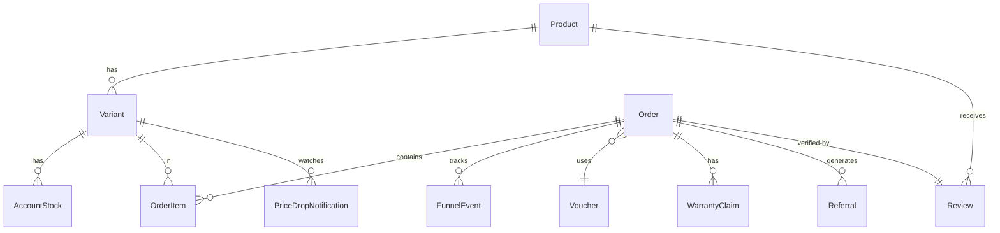

# Arsitektur Bubblepi Store

## Stack & Versi

| Layer | Teknologi | Versi |
|---|---|---|
| Framework | Next.js App Router | 16.2.10 |
| Language | TypeScript strict | ^5 |
| UI | shadcn/ui + Tailwind CSS | v4 (CSS-based config) |
| Animation | Framer Motion | ^12 |
| ORM | Prisma | ^6.19.3 |
| Database | PostgreSQL (Neon) | — |
| Payment | Xendit Invoice API | xendit-node ^7 |
| Email | Resend + React Email | ^6.17.2 |
| Auth | jose (JWT httpOnly cookie) | ^6.2.3 |
| Validation | Zod | ^4.4.3 |
| Runtime | Node.js | v24 |
| Package manager | pnpm | v9+ |
| Deployment | Vercel Serverless | — |

---

## Diagram 1: System Overview

```mermaid
graph TD
  Customer[Customer Browser] --> Storefront[Next.js Storefront]
  Admin[Admin Browser] --> AdminPanel[Admin Panel /admin]
  Storefront --> API[API Routes /api]
  AdminPanel --> API
  API --> DB[(PostgreSQL / Neon)]
  API --> Xendit[Xendit Payment]
  API --> Resend[Resend Email]
  API --> Telegram[Telegram Bot]
  Xendit --> Webhook[/api/payments/webhook]
  Webhook --> API
```

---

## Diagram 2: Checkout Flow (Sequence)

```mermaid
sequenceDiagram
  Customer->>+Storefront: Add to cart, go to checkout
  Storefront->>+API: POST /api/orders
  API->>DB: Create order (PENDING)
  API-->>-Storefront: { orderId, orderNumber, total }
  Storefront->>+API: POST /api/payments/create
  API->>+Xendit: Create invoice
  Xendit-->>-API: { invoiceUrl, invoiceId }
  API->>DB: Update order (AWAITING_PAYMENT)
  API-->>-Storefront: { paymentUrl, invoiceId }
  Storefront->>Customer: Show payment page + countdown
  Customer->>Xendit: Pay via QRIS/VA
  Xendit->>+Webhook: POST /api/payments/webhook (PAID)
  Webhook->>DB: Update order (PAID)
  Webhook->>API: fulfillOrder()
  API->>DB: Assign AccountStock (ASSIGNED → DELIVERED)
  API->>Resend: Send credentials email
  Webhook-->>-Xendit: 200 OK
  Customer->>Storefront: Poll /api/orders/[id] → FULFILLED
```

---

## Diagram 3: Data Model (Model Utama)



---

## Struktur Direktori

```
Bubblepi-Store/
├── app/
│   ├── (store)/              # Storefront pages (Next.js route group)
│   │   ├── cart/             # Halaman keranjang
│   │   ├── cek-pesanan/      # Cek pesanan by email
│   │   ├── checkout/         # 3-step checkout
│   │   ├── kategori/         # Filter kategori
│   │   ├── orders/           # Status pesanan & credential reveal
│   │   └── products/         # Listing & detail produk
│   ├── admin/                # Admin panel pages
│   │   ├── dashboard/
│   │   ├── login/
│   │   ├── orders/
│   │   ├── products/
│   │   ├── referrals/
│   │   ├── reviews/
│   │   ├── stock/
│   │   ├── vouchers/
│   │   └── warranty/
│   └── api/                  # API Routes (serverless functions)
│       ├── admin/            # Admin-only endpoints
│       ├── analytics/        # Funnel event tracking
│       ├── cart/             # Abandoned cart save
│       ├── cron/             # Scheduled jobs
│       ├── health/           # Health check
│       ├── live-activity/    # Live activity feed
│       ├── notify-me/        # Price drop notification
│       ├── orders/           # Customer order endpoints
│       ├── payments/         # Xendit create + webhook
│       ├── products/         # Stock check, upsell
│       ├── referral/         # Referral program
│       ├── reviews/          # Product reviews
│       ├── stats/            # Social proof stats
│       ├── vouchers/         # Voucher validation
│       └── warranty/         # Warranty claims
├── components/
│   ├── admin/                # Admin UI components
│   ├── checkout/             # Checkout step components
│   ├── order/                # Order status components
│   ├── product/              # Product card, detail
│   ├── store/                # Storefront layout components
│   └── ui/                   # shadcn/ui base components
├── context/                  # React context (cart, etc.)
├── design-system/            # Bubblepi design tokens & pages
├── docs/                     # Project documentation
├── emails/                   # React Email templates
├── lib/                      # Shared utilities & integrations
├── prisma/
│   ├── migrations/           # DB migration history
│   ├── schema.prisma         # Data model
│   └── seed.ts               # Seed script
├── public/                   # Static assets
├── scripts/                  # One-off scripts (encrypt-credentials)
├── tests/                    # Test files
└── types/                    # Global TypeScript types
```

---

## Modul Utama (`lib/`)

### `lib/env.ts`
Validasi environment variables saat startup menggunakan Zod schema. Melempar error di production jika ada variabel yang hilang atau tidak valid. Semua modul mengimpor `env` dari sini, bukan dari `process.env` langsung.

### `lib/order.ts` — `fulfillOrder(orderId)`
Inti fulfillment otomatis:
1. Temukan semua `OrderItem` dalam pesanan
2. Per item, lakukan `$transaction` Prisma untuk atomically assign `AccountStock` (AVAILABLE → ASSIGNED) — mencegah overselling
3. Jika stok kosong, set status `PENDING_STOCK` dan kirim notifikasi Telegram
4. Jika semua item terpenuhi: update status `FULFILLED`, set stok ke `DELIVERED`, kirim email kredensial
5. Dekripsi AES-256-GCM sebelum mengirim ke email

### `lib/crypto.ts`
Enkripsi/dekripsi AES-256-GCM menggunakan `node:crypto` built-in. Format tersimpan: `iv:authTag:ciphertext` (hex, colon-delimited). Key dari `ENCRYPTION_KEY` (64-char hex = 32 bytes). Auth tag mencegah tampering (integrity verification).

### `lib/mailer.ts`
Wrapper Resend SDK dengan fungsi per jenis email:
- `sendOrderConfirmation` — link pembayaran
- `sendPaymentReceived` — notifikasi lunas
- `sendAccountDelivery` — kredensial akun
- `sendOrderExpired` — pesanan kadaluarsa
- `sendLowStockAlert` — alert stok kritis ke admin
- `sendWarrantyClaimReceived` — konfirmasi klaim garansi

### `lib/rate-limit.ts`
In-memory token bucket rate limiter menggunakan `Map` dengan sliding window. Tidak memerlukan Redis. State direset saat cold start (Vercel serverless). Lihat [ADR-001](./DECISIONS.md) untuk konteks dan upgrade path.

### `lib/xendit.ts`
Wrapper Xendit SDK: `createInvoice()` membuat invoice dengan 24h expiry, mendukung QRIS dan Virtual Account. Lihat [ADR-005](./DECISIONS.md).

---

## API Routes Index

Lihat [`docs/API.md`](./API.md) untuk dokumentasi lengkap per endpoint.

**Public Storefront** — `POST /api/orders`, `POST /api/payments/create`, `GET /api/orders/[id]`, `GET /api/orders/lookup`, `POST /api/vouchers/validate`, `GET /api/reviews`, `POST /api/reviews`, `POST /api/warranty`, `GET /api/warranty`, `POST /api/notify-me`, `POST /api/analytics/event`, `POST /api/cart/save`, `GET /api/referral`, `GET /api/stats/social-proof`, `GET /api/products/stock`, `GET /api/products/upsell`, `GET /api/health`, `GET /api/live-activity`, `GET /api/orders/[id]/resend-email`, `GET /api/orders/lookup-by-email`, `GET /api/reviews/featured`

**Admin** — semua di `/api/admin/**`, dilindungi JWT cookie admin

**Webhooks** — `POST /api/payments/webhook` (Xendit, dilindungi `x-callback-token`)

**Cron Jobs** — semua di `/api/cron/**`, dilindungi `Authorization: Bearer CRON_SECRET`

---

## Keamanan

| Mekanisme | Detail |
|---|---|
| Enkripsi kredensial | AES-256-GCM, `ENCRYPTION_KEY` env var, format `iv:authTag:ciphertext` |
| Admin auth | JWT RS256/HS256 via `jose`, httpOnly cookie, 8 jam expiry |
| Webhook auth | Header `x-callback-token` dibandingkan `XENDIT_WEBHOOK_TOKEN` |
| Cron auth | Header `Authorization: Bearer CRON_SECRET` |
| Rate limiting | In-memory per IP: create-order (10/jam), payment (10/jam), voucher (20/jam), analytics (100/menit), webhook (100/menit) |
| Env validation | Zod schema di startup — gagal cepat di production jika variabel hilang |
| Prisma transactions | `$transaction` untuk stock assignment — mencegah race condition/overselling |
| Input validation | Zod schema di semua endpoint public yang menerima body |

---

## Cron Jobs

Dikonfigurasi via `vercel.json`. Semua endpoint di `/api/cron/**` memerlukan header `Authorization: Bearer CRON_SECRET`.

| Endpoint | Jadwal | Fungsi |
|---|---|---|
| `/api/cron/check-expired-orders` | Setiap jam | Mark pesanan PENDING/AWAITING_PAYMENT > 24 jam sebagai FAILED, kirim email notifikasi |
| `/api/cron/retry-emails` | Setiap 30 menit | Retry email gagal untuk pesanan FULFILLED (max 5 attempt) |
| `/api/cron/low-stock-alert` | Setiap hari | Kirim alert ke admin jika varian memiliki stok < 3 unit |
| `/api/cron/abandoned-cart` | Setiap jam | Kirim reminder ke email yang meninggalkan keranjang > 1 jam lalu |
| `/api/cron/daily-report` | Setiap hari | Laporan harian via email/Telegram |
| `/api/cron/weekly-summary` | Setiap minggu | Ringkasan mingguan |
| `/api/cron/renewal-reminder` | Setiap hari | Reminder perpanjangan akun |
| `/api/cron/auto-cancel` | Setiap jam | Auto-cancel pesanan stale |
| `/api/cron/auto-cleanup` | Setiap minggu | Cleanup data lama |
| `/api/cron/auto-expire` | Setiap hari | Expire stok kadaluarsa |
| `/api/cron/auto-retry` | Setiap 15 menit | Retry fulfillment untuk PENDING_STOCK |
| `/api/cron/stok-kritis` | Setiap hari | Alert Telegram stok kritis |

---

## Analytics Funnel

Events yang dilacak di tabel `funnel_events`:

```
VIEW_PRODUCT → ADD_TO_CART → CHECKOUT_START → PAYMENT_INITIATED → PAYMENT_SUCCESS
```

Setiap event menyimpan `sessionId` (anonymous, dari localStorage), `productId`, dan `variantId`. Events dikirim via `POST /api/analytics/event` dengan rate limit 100 request/menit per IP. Data digunakan untuk mengukur conversion rate per produk/varian.
